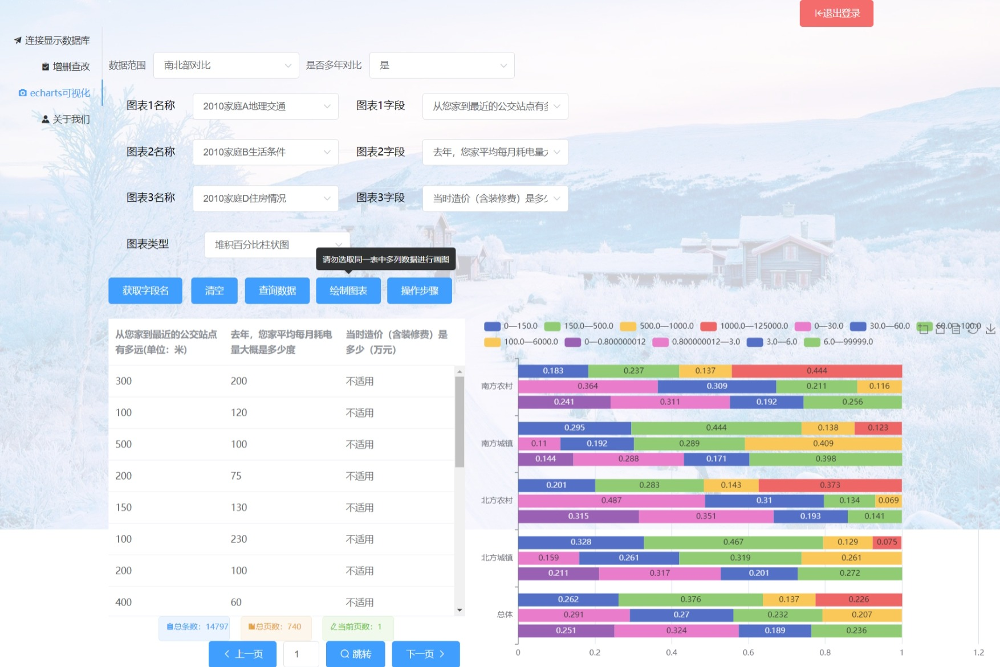

# CFPS Data Analysis and Web Development

**简介**：山东大学（威海）2020级数科与人工智能实验班前端开发与数据库项目。基于北京大学中国社会科学调查中心（ISSS）的中国家庭追踪调查（China Family Panel Studies，CFPS）数据。项目第一部分对数据进行了清洗、筛选及入库；第二部分设计了数据分析报告展示网站；第三部分开发了CFPS数据在线操作及可视化网站。

**项目周期：**2021年10月—2022年2月

**项目组成员**：范传进、许家路、赵依洋

**展示及讲解视频(Bilibili)：**[【数据库设计】中国家庭追踪调查数据库设计-山大威海大二上web开发与数据库项目A](https://www.bilibili.com/video/BV1YF411h758/); [【网站开发】城乡差距与乡村振兴的碰撞—山大威海大二上web开发与数据库项目B](https://www.bilibili.com/video/BV1Qi4y1R7WF/); [在线数据可视化网站—山大威海大二上web开发与数据库项目C](https://www.bilibili.com/video/BV1tq4y187n6)

## 项目功能概述

1. 登陆注册系统，可供多用户同时登陆，为每个用户对应一份数据库


2. 可连接显示 拆分清洗好的CFPS2010-2018年数据库，页面上可以列出数据库的所有表格，选择一个表格，可以列出所有数据


3. 可在输入框中输入任意 SQL 语句，进行各种数据库操作（从不同表格抽取数据产生新表、数据合并、删除、添加及运算等等）


4. 对抽取出来的数据进行可视化，支持基础折线图、面积图、柱状图、极坐标柱状图、条形图、堆叠折线图、堆叠面积图、堆叠柱状图、饼图、环形图、玫瑰图、嵌套环形图、散点图、气泡图、漏斗图、堆积条形图、堆积柱状图、极坐标堆积柱状图、堆积百分比柱状图、三维柱状图、象形柱状图等21种可视化方法




## 功能模块说明

### 前端

#### 1.前端整体介绍

* **框架：vue**

* **前端文件结构**

  前端工程demo文件夹包含一下文件夹/文件:

  * src：存储vue文件
    * router：路由文件
    * views：三个vue页面
      * function.vue:功能界面
      * introduction.vue:介绍页面
      * login.vue:登录页面
    * App.vue:配置vue文件
    * main.js:导入需要的包
    * registerServiceWorker.js：vue配置文件
  * 其余文件均为创建工程时自动生成文件

#### 2.前端-介绍页面

**<font color=DodgerBlue>相关文件：demo/src/introduction.vue</font>**

1. 介绍页面使用了index接口获取浏览量。在页面初始化时，调用axios的get请求从后端获取浏览量，通过vue特有的方式将获取的数据显示到页面上，具体代码如下

```vue
<template>
  <div>
    <p>访问量：{{fangwen}}</p>
  </div>
</template>

<script>
export default {
    import axios from 'axios';
    created() {
      axios.get('http://82.156.173.187:8040/index').then(res => {
        this.fangwen = res.data.time
      })
    },
    data(){
    return{
        fangwen:0
        }
    }
}
</script>

<style>

</style>
```

2. 介绍页面使用了this.$router.push()函数使得点击右上角登录注册按钮时，实现页面跳转，其中变量的值是在创立项目时，在demo/src/router/index.js中进行设置，具体代码如下图

```javascript
import Vue from 'vue'
import VueRouter from 'vue-router'
import f from '../views/function.vue'
import introduction from '../views/introduction.vue'
import login from '../views/login.vue'

Vue.use(VueRouter)

const routes = [
  {
    path: '/index',
    name: 'function',
    component: f
  },
  {
    path: '/',
    name: 'introduction',
    component: introduction
  },
  {
    path: '/login',
    name: 'login',
    component: login
  },

]

const router = new VueRouter({
  routes
})

export default router

```

3. 介绍页面通过window.addEventListener('scroll', this.jianting)函数设置监听器，在用户下滑到指定位置时，调用jianting（）函数，让标题文字出现。

#### 3.前端-登录界面

**<font color=DodgerBlue>相关文件：demo/src/login.vue</font>**

登录界面使用了login，register，change_password三个接口，实现登录，注册，更改密码

1. 登录操作——login接口：判断用户输入账号，密码不为空后，调用login接口将用户输入的账号和密码发送至后端，之后根据后端返回成功或者失败，执行不同的操作，若为成功，则通过this.$router.push()函数跳转到功能界面，若为失败，则跳出登录失败的弹框
2. 注册操作——register接口：判断用户输入各项不为空以及两次输入密码一致后，调用register接口将用户输入的账号密码发往后端，后端会为用户复制数据库，此阶段前端界面的登录，注册按钮将无法点击，直到后端数据库创建成功。
3. 更改密码——change_password接口：判断用户输入各项不为空以及两次输入密码一致后，调用change_password接口将用户输入的账号密码发往后端，后端更改完用户密码后返回success，前端显示对应提示。

#### 4.前端-token验证

**<font color=DodgerBlue>相关文件：demo/src/login.vue</font>**

用户在登录成功后，后端会返回该用户的access_token与refresh_token，同时通过this.$session.set（）将收到的token值存储起来，在功能界面中每次调用端口时，token都会被放进headers中发送给后端，提升了网站的可用性与安全性


#### 5.前端-功能界面

**<font color=DodgerBlue>相关文件：demo/src/function.vue</font>**

##### 5.1连接显示数据库

页面使用table_names和get_table两个接口连接数据库以及获取用户所选表中的所有字段

1. 连接数据库——table_names：用户点击连接数据库后，前端向后端发送get请求，后端将数据库中的所有表名返回至前端，前端将显示表单名称下拉框以及获取数据按钮，同时前端会将从后端获取到的所有表名放入下拉框中供用户选择。
2. 获取用户所选表的所有字段——get_table：用户选取完所需数据表后，点击获取数据，前端通过get_table接口把数据发送至后端，获取到后端返回的数据后，将所有的数据放入表格中供用户查看。

##### 5.2增删查改

页面使用get_records和curd两个接口来获取用户过去10条mysql操作以及增删查改

1. 获取用户过去10条操作——get_records：在页面初始化时，调用get_records接口，从后端获取用户过去10条操作，并将其放入输入框上方的表格中。
2. 增删查改——curd：点击发送命令，调用curd接口，将命令发送至后端，后端进行相应的操作，若有返回值，则在页面下方生成表格，将数据放入表格中。

##### 5.3echarts可视化

（使用可视化之前需先连接数据库）

页面使用get_cols，select_cols和count三个接口来实现获取字段名，获取数据，绘制图表

1. 获取字段名——get_cols:用户先确定数据范围以及选取图表的个数，通过点击获取字段名，前端会将用户选择的图表名称发送至后端，获得后端返回的各个图表中字段的名称后，将这些数据分别放入对应的下拉框中，供用户选择。
2. 获取数据——select_cols:用户选取所需的字段，点击获取数据，前端会将图表名称以及字段名称一并发送至后端，前端获取到数据后，会放入表格中供用户查看。
3. 绘制图表——count：在第二阶段获取数据时，后端会给前端返回用户所选的数据为计算均值型或是计算比例型，前端会根据用户选择的图表数量以及类型，显示对应图表的下拉框供用户选择，具体对应关系，详见图表说明excel。用户选取所需的数据，点击绘制图表，后端会将用户所选的数据进行处理发送给前端，前端会根据用户选择显示对应的图表

##### 5.4网站优化

由于CFPS数据库中数据量十分巨大，一次性将所有数据录入表格中会使得页面卡顿，所以网页采用分页加载的方式，大大减少了每次写入表格的数据量，使得网站更加流畅，进一步改善用户的使用体验。

### 后端

#### 1. 后端整体介绍

* **语言：Python**
* **框架：fastapi**
* **后端文件结构**


&emsp;&emsp;后端工程fastapi0215包含以下文件夹/文件：

* 	**app: fastapi实例，相当于python包**
  * 	**models: 定义前后端交互中的请求体，python子包**
         * auth.py: 定义token验证中的请求体
         * database.py: 定义数据库操作中的请求体
         * settings.py: 设置
         * token.py: 定义token验证中的请求体
         * user.py: 定义用户系统的请求体
         * visualize.py: 定义可视化数据运算的请求体
  * 	**routers: 处理前端请求，python子包**
       * 	auth.py: 处理token验证的请求
       * 	database.py: 处理数据库操作的请求
       * 	user.py: 处理用户系统的请求
       * 	visitor.py: 处理访客记录的请求
       * 	visualize.py: 处理可视化运算的请求
* 	**data: json数据文件**
     	* col_names.json: 记录所有年份、所有表格所有字段的中英文名称
     	* visitor.json: 记录访客人数
  * 	**utils: 各个模块的功能函数**
       	* database.py: 数据库操作功能函数
       	* hashing.py: 哈希加密功能函数
       	* validate.py: 有效性验证功能函数
       	* visualize.py: 可视化数据运算功能函数
  * 	**main.py: 主函数，用于运行fastapi**
  * **requirements.txt: 记录后端需要的python包**

#### 2. 后端-用户系统

**<font color=DodgerBlue>相关文件：app/models/user.py、app/routers/user.py、utils/hashing.py、utils/validate.py、data/col_names.json、utils/database.py数据库</font>**

&emsp;&emsp;用户系统一共用到了三个接口，分别是register注册、login登录、change_password。在models/user.py中，定义了注册、登录接口请求体的参数为username用户名和password密码；修改密码接口请求体的参数为username用户名和new_password新密码。下面对register接口（url：/register）进行详细说明。

1) 在Register函数中，首先要判断用户名和密码是否符合规范，调用了is_valid_username和is_valid_password两个函数，这两个函数在utils/validate.py中，它们规定了用户名只能由字母、数字和下划线组成且长度应不少于3位，不得多于12位，密码长度应该在6位和16位之间，也对这两个函数进行了相应的导入。如果其返回值不是success，则向前端返回失败以及对应原因。

2) 第二步，连接user用户数据库，查询该用户名是否已存在。需要说明的是，**`本项目操作MYSQL数据库均使用pymysql包`**，其通过游标操作数据库，详细的使用方法可以查阅相关资料。进行到这里，表明用户名和密码都是符合规范的，下面要将其写入数据库。

3) 第三步，对密码进行加密。我在此处调用了密码加密算法库passlib，使用其中的函数进行哈希加密，哈希加密是单向加密，也就是说，**`只能将明文加密为密文，而不能将密文解密为明文`**。这样的好处是，即使有小偷偷走了用户数据库，他只能得到加密后的数据，无法得到用户的密码，这样可以增强本网站的安全性。

4. 第四步，将加密后的用户名、密码写入user数据库，使用insert语句。

5. 由于用户需要对数据库进行增删查改等操作，所以第五步需要**`为每个新用户复制所有的数据表`**，格式为表名称下划线用户名，这样**`每个用户就有其对应的数据库`**了，复制数据库的函数在utils/database.py中。

6. 最后一步，为该用户复制json数据文件，在数据库操作中会讲解复制的数据库和该json文件。

&emsp;&emsp;login接口就比较简单了，对用户输入的密码进行哈希加密，并与查询出该用户加密后的密码进行比对，若一致，则登陆成功，否则登陆失败。登陆成功后，生成对应access_token和refresh_token，并返回给前端。稍后会对token进行详细讲解。

&emsp;&emsp;change_password接口也与之类似，判断该用户是否存在、新密码是否合法，加密后写入数据库，最后返回给前端数据即可。

**<font color=Orange>下面使用postman测试login接口</font>**：


#### 3. 后端-token验证

**<font color=DodgerBlue>相关文件：app/models/auth.py、app/models/settings.py、app/models/token.py、app/routers/user.py</font>**

&emsp;&emsp;本网站使用了**`双token验证机制`**，就是在登陆操作之后由后端返回两个token：access_token和refresh_token，其中access_token的过期时间相当短，我设定的是两个小时，refresh_token的过期时间相对于access_token而言相当长。在之后的操作中一般使用access_token进行验证，后端通过access_token即可获取用户名。**`若access_token过期，则使用refresh_token获取新的access_token。如果refresh_token也过期了，就需要重新登录`**。双token机制增强了网站的安全性和可用性。

&emsp;&emsp;本项目中使用fastapi的扩展包fastapi_jwt_auth进行token生成、验证和刷新。用户登录时就是调用这个包中的函数生成两个token。之后，前端每次向后端发请求时，都将access_token放在请求头header中，后端进行验证，并由token获取用户名。access_token过期时，调用refresh接口，验证refresh_token，刷新并返回新的access_token。

**<font color=Orange>双token流程图</font>**：


#### 4. 后端-数据库操作

**<font color=DodgerBlue>相关文件：app/models/database.py、app/routers/database.py、data/col_names.json、utils/database.py、数据库</font>**

**1.  table_names、get_table、page1接口，对应“连接显示数据库”界面**

&emsp;&emsp;**<font color=LimeGreen>功能：向前端发送该用户所有表格名称、某个表格的数据</font>**

&emsp;&emsp;table_names:  get类型，它通过查找数据库中带有该用户名称的数据表，返回该用户所有表格名称

&emsp;&emsp;get_table:  post类型，先查询该表格的所有数据，但数据库中的字段名称均为英文，**`没有使用过CFPS数据的用户难以理解，需要加上中文释义`**。这里就用到了之前提到的col_names.json，根据数据库英文字段名，即可查询到中文字段名。**`值得一提的是，最初我们将一个表格所有数据全部展示在前端，一个表格的数据往往有几百列、上万行，这导致网站十分卡顿。后来我们使用分页传输数据、分页展示数据的方法解决了网站卡顿的问题`**。

&emsp;&emsp;get_table接口只向前端发送记录数、页数、中英文字段名和前20条数据，page1接口用于发送指定页数的数据，其原理与get_table较为相似。

<font color=Orange>get_table接口测试</font>：


**2.  curd、page2、get_records接口，对应增删查改页面**

&emsp;&emsp;**<font color=LimeGreen>功能：增删查改数据库、记录/读取用户操作记录</font>**

&emsp;&emsp;增删查改给数据库主要通过curd接口实现，输入框其实就相当于一个mysql的shell，后端将命令发送给数据库即可。需要注意的是，**`为了给每个用户对应一份数据库，该用户的数据表名称为原始名称下划线用户名，但用户看到的数据表名称不带有其用户名。所以，后端收到sql指令时，需要先将其中的表格名称进行转换，再执行sql语句`**。**`如果执行成功，需要将操作记录写入user数据库，如果用户输入的是SELECT语句，还需要向前端返回中英文字段名和前20条数据`**，此处与get_table较为相似。

&emsp;&emsp;page2接口则类似于page1接口，用于分页传输数据。get_records接口用于向前端发送该用户执行sql语句的历史记录。

**3.  col_names、get_cols、select_cols、page3接口，对应可视化界面中绘图前的各项操作**

&emsp;&emsp;**<font color=LimeGreen>功能：选取、展示用于可视化的数据</font>**

&emsp;&emsp;col_names向前端返回整个col_names.json中的数据。用户选择数据表后，需要查看这几个表有哪些字段，get_cols即是给前端返回这几个表的所有字段中文名称，对应“获取字段名”接口。而select_cols用于获取这个字段的数据类型，即可计算数据值或可计算比例型，以及前20条数据，对应“查询数据”按钮。page3与page1、page2相似，此处不再赘述。

**<font color=Orange>使用postman测试get_cols接口</font>**：


#### 5. 后端-可视化中的数据运算

**<font color=DodgerBlue>相关文件：app/models/visualize.py、app/routers/visualize.py、utils/visualize.py</font>**

&emsp;&emsp;可视化中的数据运算调用了后端的接口Count。Count请求体的参数有图表序号、region地区，即南北或东中西、字典tip，其中包含所选字段的信息。

&emsp;&emsp;**`我们将所有字段分为可计算数值型和可计算比例型`**，比如2010家庭A地理交通中的“从您家到最近的公交站点有多远(单位：米)”，其回答的答案均为数值，属于计算数值型；而2010家庭B生活条件中的“您家做饭用的水最主要是”，其答案有自来水、井水/山泉水、窖水等选项，属于计算比例型。**`这两种类型的字段，分别可以绘制不同类型的图表，它们的组合可以绘制另外一些类型的图表。可绘制的图表类型共计二十一种`**。

&emsp;&emsp;在routers/visualize.py中，需要根据图表序号、地区、字段数量、字段类型确定相应的统计函数。所有的统计函数都在utils/visualize.py中。以基础折线图为例，首先查看echarst官方给出的基础折线图数据格式······根据此格式，从数据库中选取数据，并进行统计运算，最后向前端返回对应格式的数据。统计数据的代码十分冗长复杂，此处就不再赘述了。

**<font color=Orange>最后再使用postman测试count接口</font>**：


### 数据库


## 相关链接

> [GitHub地址](https://github.com/xujialuu/CFPS-data-analysis): https://github.com/xujialuu/CFPS-data-analysis，其中包含三个阶段的资料
> 
> [B站地址](https://www.bilibili.com/video/BV1tq4y187n6/): https://www.bilibili.com/video/BV1tq4y187n6/
> 
> [云服务器地址](http://82.156.173.187/): **<font color=LimeGreen>82.156.173.187</font>**
> 
> [域名地址](www.fan666888.com): www.fan666888.com


## 数据库E-R图

详细的数据库架构及关系，参见第一阶段的数据库架构及关系文档

* **全局E-R图**


* **局部E-R图**
	
	* 村居E-R图
	
	
	
	* 家庭E-R图
	
	
	
	* 成人E-R图
	
	
	
	* 少儿E-R图
	
	